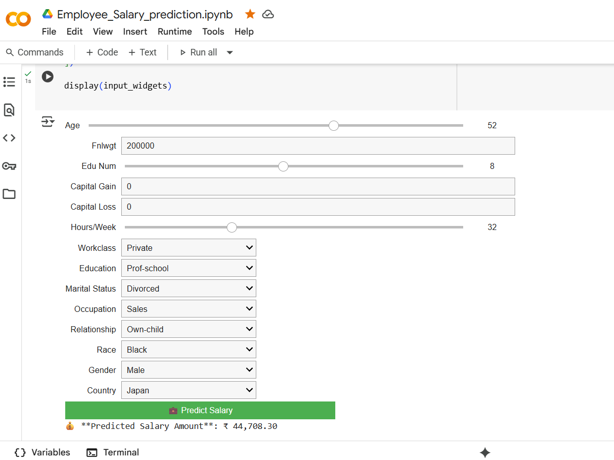

# 💼 Employee Salary Prediction using Machine Learning

This project aims to predict the **exact salary amount** of an employee based on various features such as age, education, work class, occupation, hours-per-week, etc., using machine learning models.

It also includes an interactive input form using **Google Colab widgets**, allowing users to manually enter values and receive a predicted salary in real-time.

## 📁 Project Structure

📂 Employee_Salary_Prediction/
│
├── Employee_Salary_prediction.ipynb # Main Jupyter Notebook
├── employee_salary_model.pkl # Trained model file (optional)
├── adult 3.csv # Cleaned CSV dataset
└── README.md # Project documentation

---

## 📊 Features Used

- `age`
- `workclass`
- `education`
- `marital-status`
- `occupation`
- `relationship`
- `race`
- `gender`
- `capital-gain`
- `capital-loss`
- `hours-per-week`
- `native-country`

---

## 🔧 Machine Learning Techniques

- Data Preprocessing (`LabelEncoding`, `OneHotEncoding`, `StandardScaler`)
- Train-Test Split
- Linear Regression Model
- Evaluation using MAE, MSE, and R² Score
- Real-time Prediction Interface using `ipywidgets` (Colab)

---

## 📈 Performance Metrics

- ✅ Mean Absolute Error (MAE)
- ✅ Mean Squared Error (MSE)
- ✅ R² Score
- ✅ Real-time Prediction using manual input
- ✅ Pie charts and bar plots for visual insights

---

## 🧪 How to Use

### ▶️ Run in Google Colab
1. Open the notebook in Google Colab.
2. Upload the CSV dataset (`adult 3.csv` or similar).
3. Run all cells sequentially.
4. Use the manual input widget to test predictions.

> You don’t need to install anything locally!

---

## 📸 Sample Output

---

## 🚀 Future Improvements
- Web Deployment using Streamlit or Flask
- Integration of other ML models (Random Forest, XGBoost, etc.)
- UI enhancement and result visualization

---

## 📚 Credits
Project developed by Swati Gupta 
With the help of IMB Skill Intership

